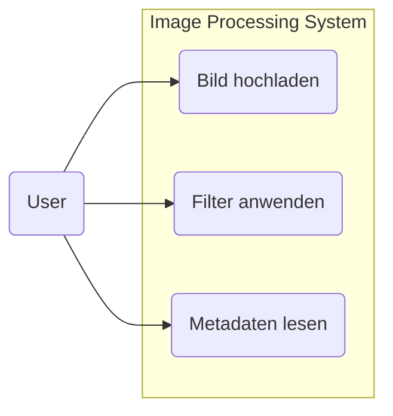
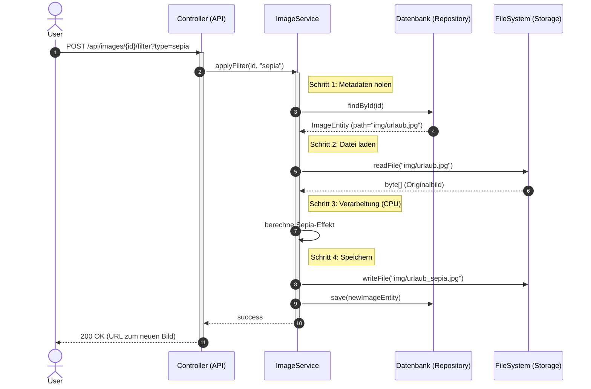
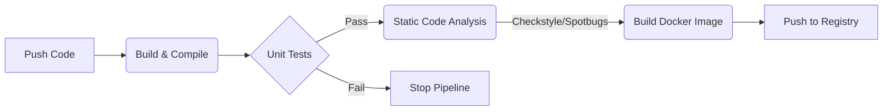

# Image Processing Service
[](https://opensource.org/licenses/MIT)


 

Ein robuster, skalierbarer Microservice zur asynchronen Verarbeitung von Bilddaten. Entwickelt als RESTful API mit Fokus auf Clean Architecture und DevOps-Prinzipien.

## Inhaltsverzeichnis
- [Über das Projekt](#über-das-projekt)
- [Features](#features)
- [Technologie-Stack](#technologie-stack)
- [Architektur](#architektur)
- [Installation & Setup](#installation--setup)
- [API Dokumentation](#api-dokumentation)
- [DevOps & CI/CD](#devops--cicd)
  
## Über das Projekt
Dieses Projekt demonstriert die Entwicklung eines Backend-Services für Medieninformatik-Anwendungsfälle. Der Service ermöglicht Nutzern das Hochladen von Bildern, das Extrahieren technischer Metadaten (EXIF) sowie die Anwendung von Filtern und Skalierungen.

Das Ziel war es, eine **Loose Coupling** Architektur zu implementieren, die für Cloud-Deployments (Docker) vorbereitet ist.

## Features
* **Bild-Upload:** Sicherer Upload und Speicherung im Dateisystem (vorbereitet für S3).
* **Metadaten-Analyse:** Automatische Extraktion von Aufnahmedatum, Größe und MIME-Type.
* **Bildverarbeitung:**
    * Anwendung von Filtern (Grayscale, Sepia).
    * Generierung von Thumbnails.
* **Persistenz:** Speicherung der Metadaten in einer relationalen Datenbank (H2/PostgreSQL).

## Technologie-Stack
* **Sprache:** Java 17
* **Framework:** Spring Boot 3 (Web, Data JPA)
* **Datenbank:** H2 (Dev) / PostgreSQL (Prod), Hibernate ORM
* **Build Tool:** Maven
* **Container:** Docker & Docker Compose
* **Testing:** JUnit 5, Mockito
* **Tools:** Lombok, Swagger/OpenAPI

## Architektur
Das Projekt folgt einer **Schichtenarchitektur (Layered Architecture)**, um die Geschäftslogik von der Infrastruktur zu trennen.

### High-Level Übersicht

### Datenfluss

## Installation & Setup
### Voraussetzungen
Java 17 JDK

Maven

Docker (optional)

### Lokal starten
1. Repository klonen
```bash

git clone [https://github.com/DEIN-USER/image-processing-service.git](https://github.com/DEIN-USER/image-processing-service.git)
cd image-processing-service
```
2. Bauen & Testen
```bash
mvn clean install
```
3. Anwendung Starten
```bash
mvn spring-boot:run
```
Der Server startet unter http://localhost:8080.

Mit Docker starten (sobald implementiert)
```bash
docker-compose up --build
```
## API Dokumentation
Die API ist vollständig via Swagger UI dokumentiert. Nach dem Start der Anwendung verfügbar unter: http://localhost:8080/swagger-ui.html

## DevOps & CI/CD

Die Anwendung ist für den Betrieb in Container-Umgebungen konzipiert. Der Entwicklungsprozess wird durch eine automatisierte Pipeline unterstützt.

### Containerisierung
Das Projekt verwendet **Docker**, um eine konsistente Laufzeitumgebung zu gewährleisten.
* **Dockerfile:** Multi-Stage Build, um das finale Image klein und sicher zu halten (Verwendung von `eclipse-temurin:17-jre-alpine` für Production).
* **Docker Compose:** Orchestriert den Application-Container zusammen mit der Datenbank für die lokale Entwicklung.

### CI Pipeline (GitHub Actions)
Jeder Push auf den `main`-Branch oder Pull Request löst die CI-Pipeline aus. Ziel ist es, die Code-Qualität sicherzustellen, bevor gemerged wird.

#### Pipeline Workflow

Die Pipeline umfasst folgende Schritte:

1. Build: Kompilierung des Java-Codes mit Maven.

1. Test: Ausführung der JUnit-Tests.

1. Quality Gate: Prüfung auf Clean Code Verstöße (Checkstyle) und Bugs.

1. Package: Erstellen des Docker Images (bei erfolgreichen Tests).

Entwickelt von Yazan Sourakli als Portfolio-Projekt
